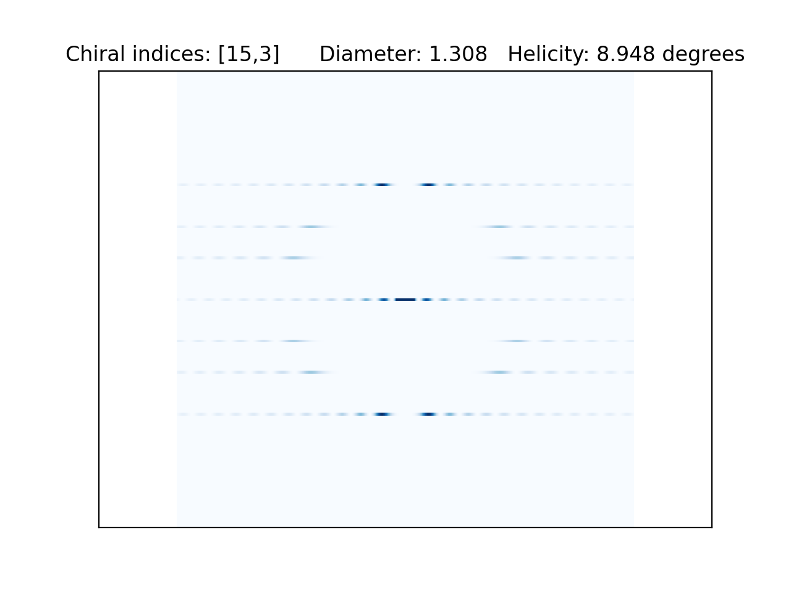

#### Find the [website here](http://54.202.108.188:8501/) to precisely determine your chiral indices from your diffraction patterns. 

## High precision determination of chiral indices of electron diffraction patterns from carbon nanotubes
The chiral indices that define the structure of a carbon nanotube can be precisely and automatically determined with deep learning. This work introduces a program for the simulation of the diffraction patterns of carbon nanotubes, which can be analytically expressed using the diffraction theory for helices. A convolutional neural network architecture is proposed to process diffraction pattern images of carbon nanotubes and determine the chiral indices of the nanotube. The model determines the chiral indices of the carbon nanotube with greater than 98% accuracy on the test set of simulated diffraction patterns. The geometry and diffraction theory of carbon nanotubes is also introduced.

  

    
  

  

    
  

### TO ADD: 
- Create a user interface for the deep learning code       

          I still need to connect the convolutional neural network to the streamlit site (which currently only simulates the diffraction patterns).
- Cache so that the linear -> logarithmic transition doesn't require re-calculating Bessels.

            - Run for the first time and save state ('Linear' or 'Log.')
            - Use operation to transfer between
